# Hotel Property Management System

> Production system used daily by hotel operations staff across five role-based
> logins. Built and deployed solo under contract. **Application source is private
> client property — this repository documents the architecture, interface and
> engineering decisions.**

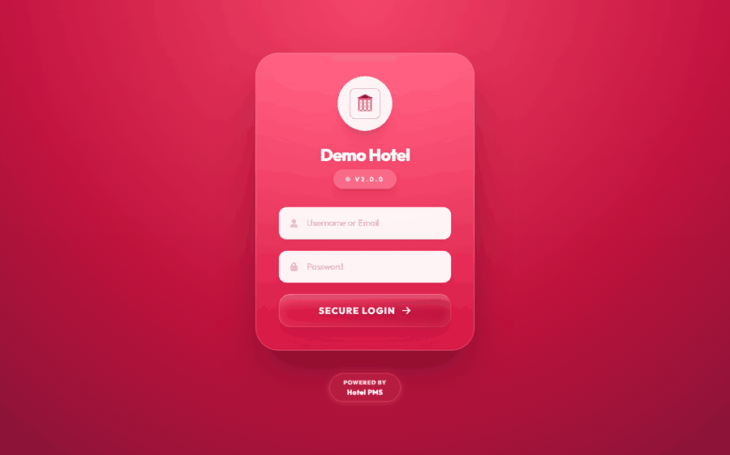

Sign in · live room board with occupancy · housekeeping's own scoped view · task assignment · payroll with figures masked by default · daily reporting. Recorded against a local demo database — every guest name, staff name and figure shown is invented.

---

## The problem

Housekeeping ran on paper. A supervisor walked the floors with a clipboard, wrote
down which rooms were dirty, handed slips to housekeepers, and collected them back.
Front desk had no way to know a room was ready without asking someone. Payroll was
reconstructed at month-end from attendance scribbled in a register.

The failure mode was always the same: a guest checked in to a room nobody had
confirmed was clean, or a clean room sat empty because the information hadn't
reached the front desk yet.

## What I built

A single application covering room state, housekeeping assignment, task management,
leave requests, attendance-derived payroll, and an activity log — with the view
adapting to whoever logs in.

**My role:** sole engineer. Requirements gathering on-site, data modelling, build,
deployment onto hotel hardware, and ongoing support.

**Timeline:** built and deployed over roughly four months, early-to-mid 2026.
**Status:** live in production.

---

## Architecture

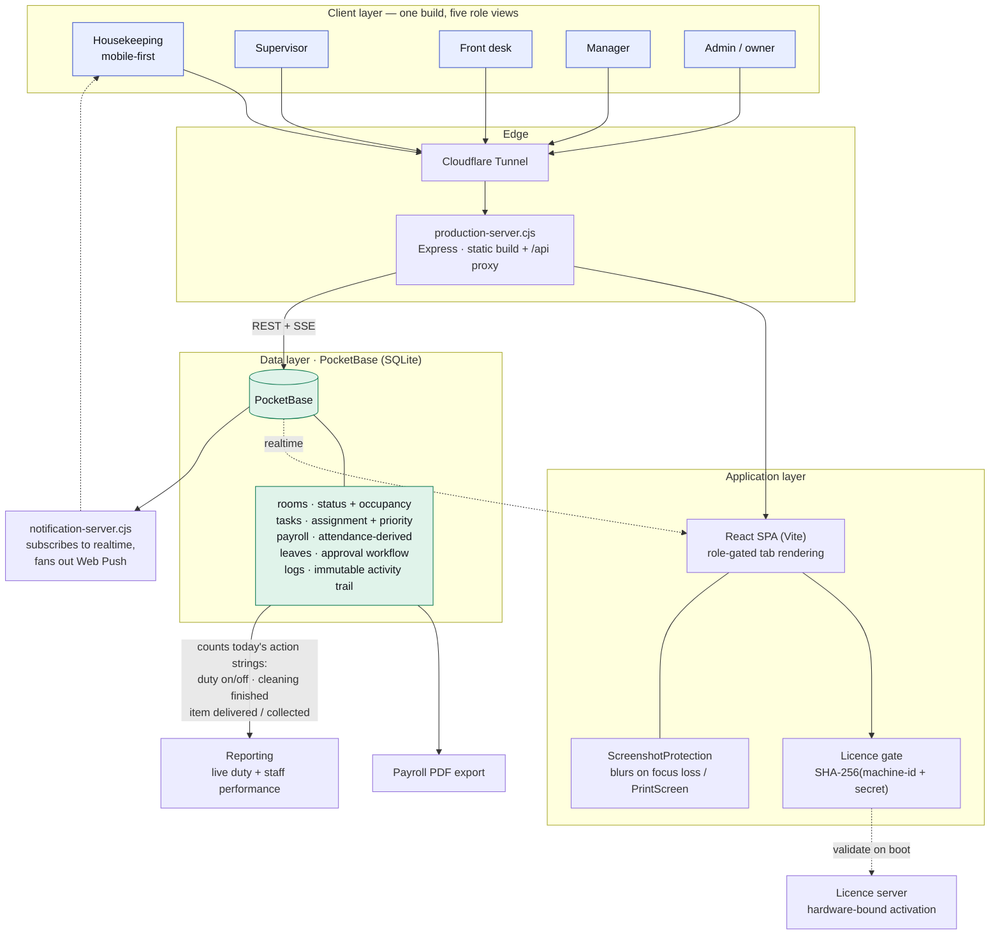

**One instance, one staff table, role at the centre.** Unlike a multi-tenant
system, there is a single property and a single database. The role field
(`housekeeping`, `front_desk`, `supervisor`, `manager`, `admin`) drives both which
tabs render and what the API returns. Housekeeping sees assigned rooms and tasks;
the front desk sees the floor and occupancy; manager and admin add staff, leave and
payroll.

---

## Interface

Full walkthrough of the system. **[Features and functionality →](FEATURES.md)**

### The floor

| | |
|---|---|
|  | 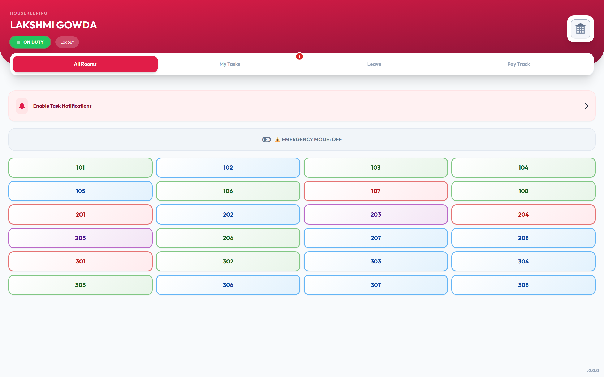 |
| **Front desk** — live occupancy with guest names, stay day counts and checkout markers | **Housekeeping** — the same rooms, scoped to what this person is responsible for |

### Work and people

| | |
|---|---|
| 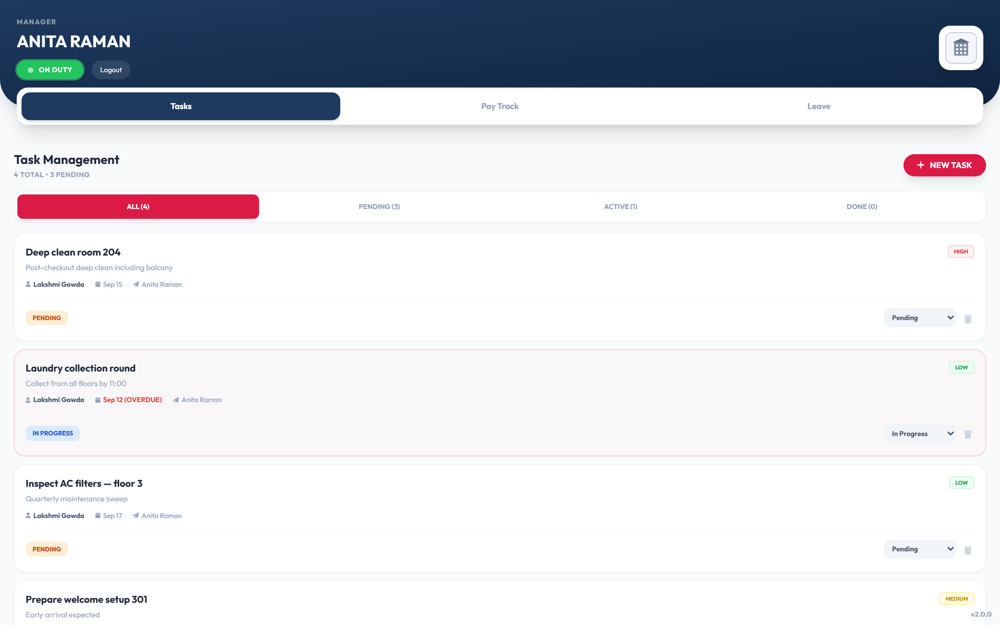 | 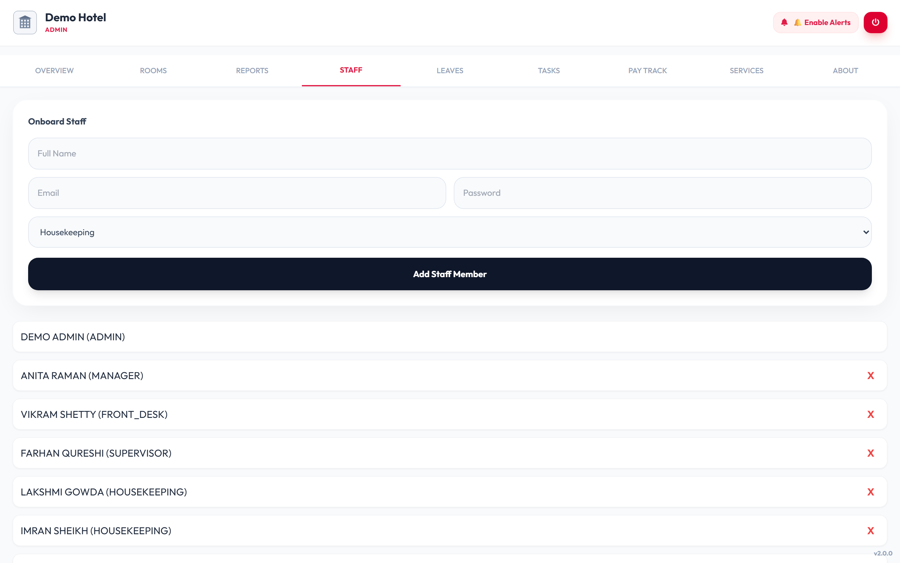 |
| **Tasks** — assigned to a named person with priority and due date | **Staff** — records, roles and duty state |
| 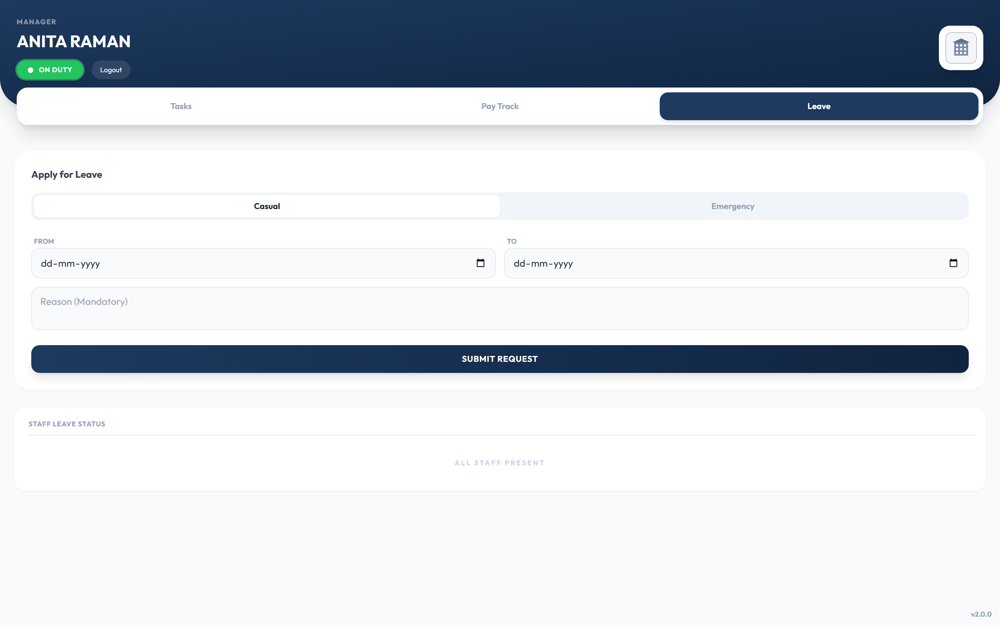 | 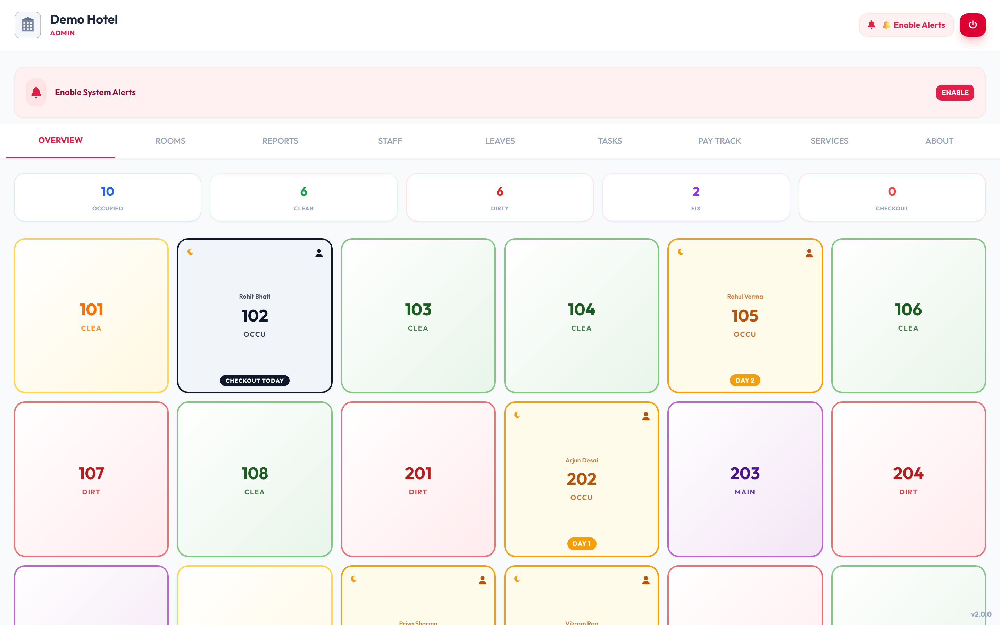 |
| **Leave** — requests with type, dates and an approval trail | **Admin** — full navigation across every area |

### Pay and reporting

| | |
|---|---|
| 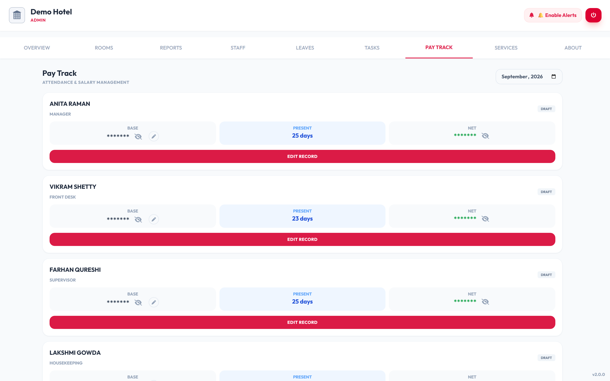 | 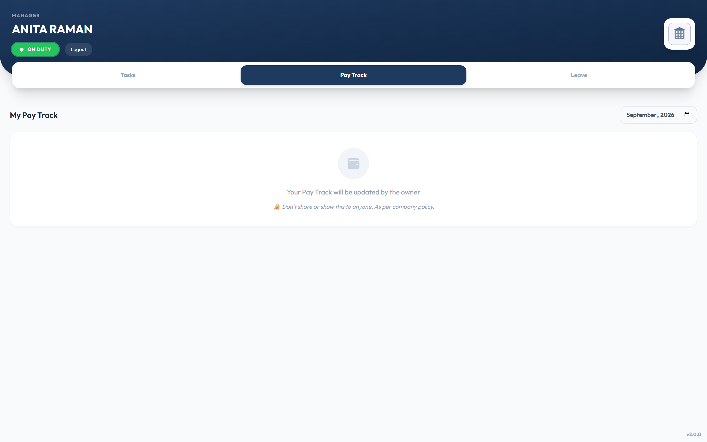 |
| **Payroll** — derived from attendance, figures masked by default | **Pay track** — the manager's view of the same records |
| 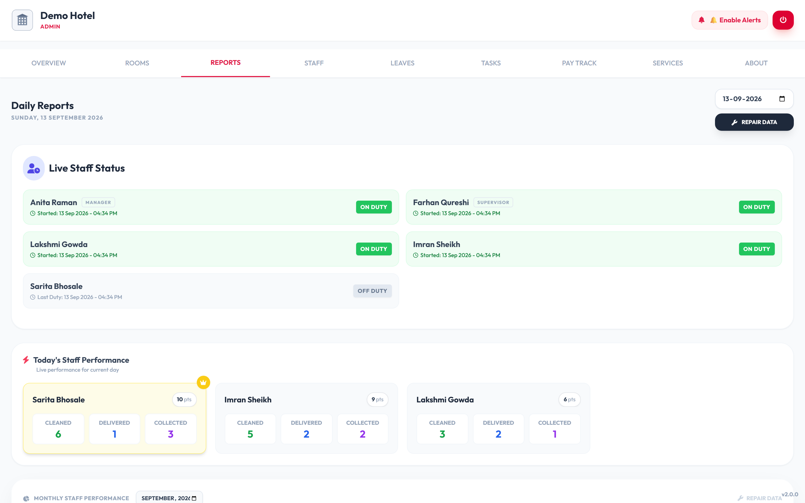 | 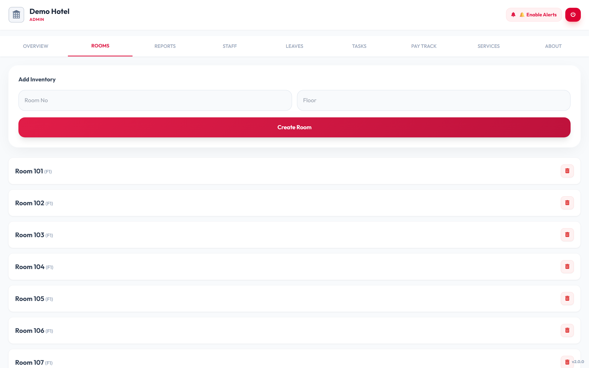 |
| **Reporting** — live duty status and per-person daily performance | **Inventory** — rooms by floor, added and managed by admin |

### Access and mobile

| | |
|---|---|
| 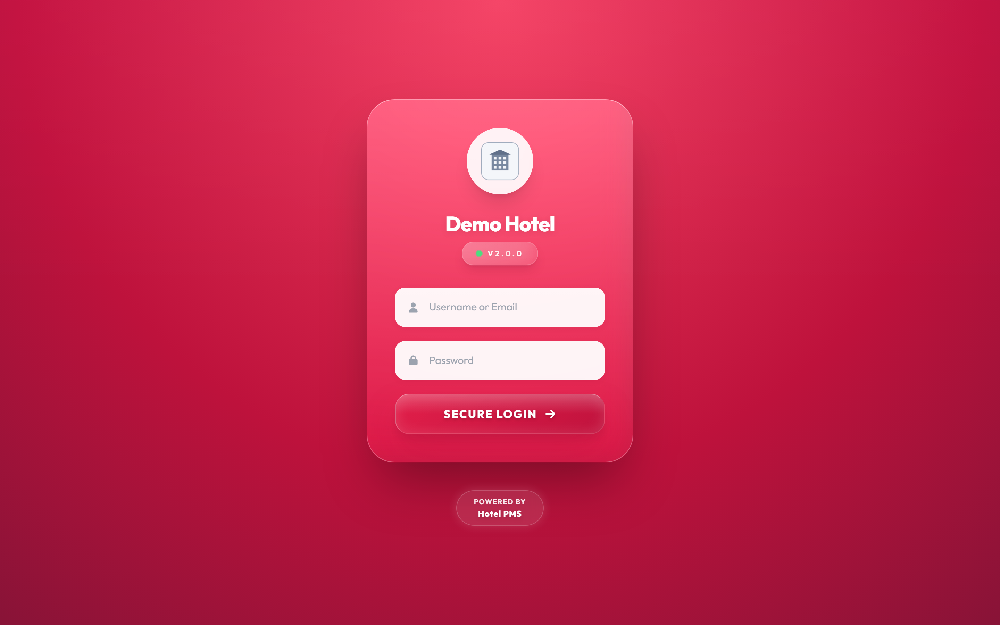 | 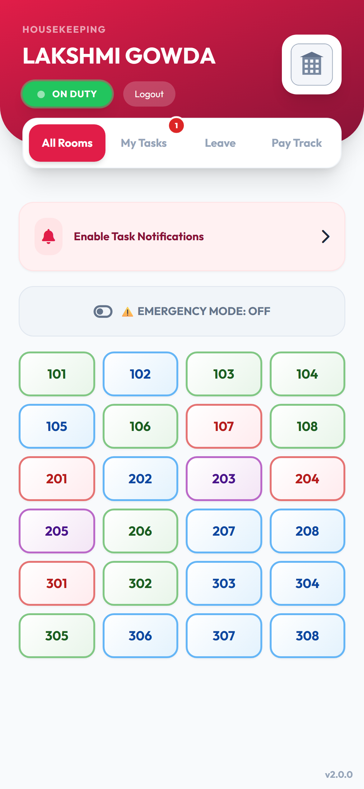 |
| **Login** — one entry point for all five roles | **Housekeeping on a phone** — where most of this work actually happens |

*All screenshots are captured against a locally seeded demo database. Every guest
name, staff name and figure shown is invented.*

---

## Technical decisions and trade-offs

**Room status is a state machine with a `previous_status` field.**
`Clean → Occupied → Checkout → Dirty → Cleaning → Clean`, with `Maintenance` and
`Damaged` as off-path states. The reason `previous_status` exists is that
maintenance is an interruption, not a transition: when a room comes back from
repair it needs to return to whatever it was before, and without that field the
system has to guess. It is one column that removes a whole class of "what was this
room before someone flagged the broken AC?" bugs.

**Reporting is derived from the activity log, not stored as aggregates.**
Staff performance counts action strings in the `logs` collection for the current
day — `cleaning finished`, `item delivered`, `item collected`. There is no
performance table to drift out of sync with reality; the log is the single source
of truth and every number is re-derived on view.

The trade-off is that the report is only as good as the log's *string* conventions.
Counting `act.includes('cleaning finished')` means a typo or a renamed action
silently produces a zero rather than an error. A typed enum on the log's `action`
field would have made the coupling explicit and is what I would change first.

**Payroll figures are masked by default.**
Salary, deductions and net pay render as `*******` behind a per-row reveal toggle.
The admin terminal sits at a front desk where staff and guests walk past; a manager
opening payroll should not broadcast what everyone earns to whoever is standing
there. It costs one click and removes an entire category of awkward incident.

**Screenshot protection as a product feature.**
The app blurs its own UI on `PrintScreen`, on window blur, and when the mouse
leaves the document. It's defence against the casual case — a staff member
photographing guest details — not against a determined attacker, and I would not
claim otherwise. It's a deterrent that raises the effort required, on a system
where the sensitive data is other people's stay records.

*(For the demo captures in this repository, that protection was overridden in the
Playwright script rather than removed from the code.)*

**Hardware-bound licensing.**
Activation is `SHA-256(machine-id + secret)` validated against a licence server on
boot, tying an install to one machine. A pragmatic answer to "what stops this being
copied to a second property" for a solo contractor who can't enforce a contract at
scale. It also means a hardware change is a support call, which is a real ongoing
cost I under-weighted at the time.

### What I'd do differently

**The `leaves` table has a relation column literally named `field`.** The type
definition carries a comment explaining this — *"CORRECT DB COLUMN NAME: 'field'"* —
which is the tell that it confused me more than once. It was a placeholder name
that survived into production because renaming it meant a migration against live
data. Small, but it's the kind of thing that costs a few minutes every time anyone
reads that query, forever.

**`App.tsx` is 178 KB.** The role-gated rendering, data fetching, room state
transitions and most of the modals live in one file. It grew that way because every
feature was faster to add in place than to extract, and the compounding cost only
showed up later. Splitting by role boundary — which is already the natural seam,
since the role decides what renders — is the refactor I'd do first.

**Error handling swallows failures silently.** Several fetches `catch` into
`console.error` and leave the UI showing an empty state. While setting up the demo
environment for this repository I hit exactly this: a malformed query returned 400,
the task list rendered "NO TASKS FOUND", and nothing in the interface indicated
anything had failed. An empty list and a broken request should not look identical
to the person using the system.

---

## Stack

**Frontend** React · TypeScript · Vite · Tailwind · Framer Motion
**Backend** PocketBase (Go binary) · Express (static serving + API proxy)
**Data** SQLite via PocketBase
**Realtime** PocketBase SSE · Web Push (VAPID) via a Node notification worker
**Reporting** jsPDF for payroll vouchers · derived-on-read staff performance
**Infrastructure** On-prem install · Cloudflare Tunnel · hardware-bound licence gate

---

## What changed for the business

**The front desk stopped having to ask whether a room was ready.**
Room readiness used to live on a supervisor's clipboard and in the heads of whoever
had walked that floor. It is now a state every role reads from the same place, the
moment it changes. The two failure modes that motivated the build — checking a guest
into a room nobody had confirmed was clean, and leaving a clean room empty because
the news hadn't travelled — both depended on that information being unshared.

**Housekeeping assignments stopped being paper slips.**
Work is assigned to a named person with a priority and a due date, and lands on
their phone as a notification rather than as a slip that has to be physically
carried to them. Nothing is assigned to "whoever is on that floor."

**A room coming back from maintenance returns to the right state.**
Maintenance is treated as an interruption rather than a step, so the system
remembers what the room was before someone flagged the broken air conditioner and
puts it back there. Previously that was a judgement call someone had to make from
memory.

**Payroll stopped being reconstructed at month-end.**
Attendance used to be scribbled in a register and turned into salary figures in a
rush at the end of the month. Duty is now recorded as it happens and payroll is
derived from it — present days, absences, deductions and net pay computed from the
same record, with advances and bonuses tracked against it.

**Leave requests stopped being conversations nobody could later verify.**
Requests carry dates, type, reason and an approval state, so both staff and
management can see what was asked and what was decided.

**Every status change became attributable.**
Who cleaned which room, when, who delivered what, who reported a fault — all of it
is written to an activity log as it happens. That log is also what the daily
performance view is computed from, so the report and the audit trail cannot
disagree with each other.

**And salary figures stopped being visible to whoever was standing nearby.**
The admin terminal sits at a front desk where staff and guests pass constantly.
Pay figures are masked by default and revealed one row at a time.

---

## A note on the source

This system is in production and owned by the client, so this repository does not
contain the application. Everything here — architecture, interface, decisions — is
my own work, and I'm happy to walk through any part of the implementation.

**Kuldeep Patra** · [LinkedIn](https://www.linkedin.com/in/kuldeeppatra) · kuldeeppatra8@gmail.com
